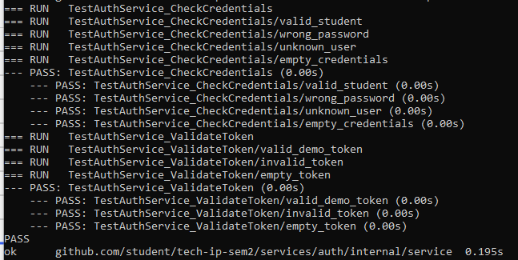
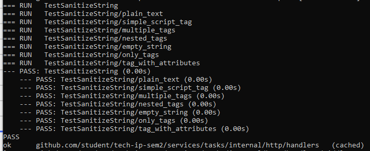
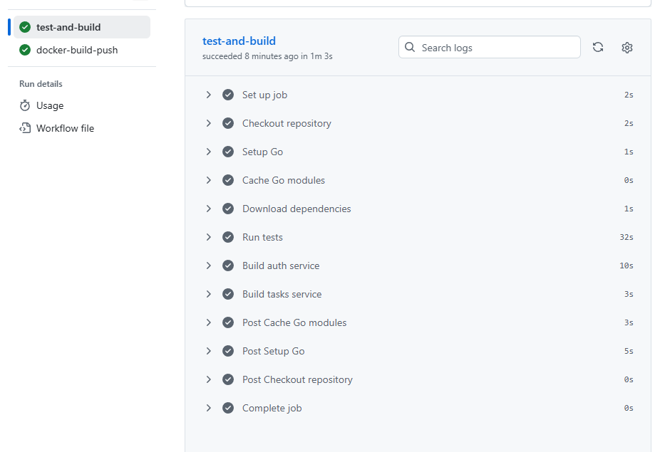
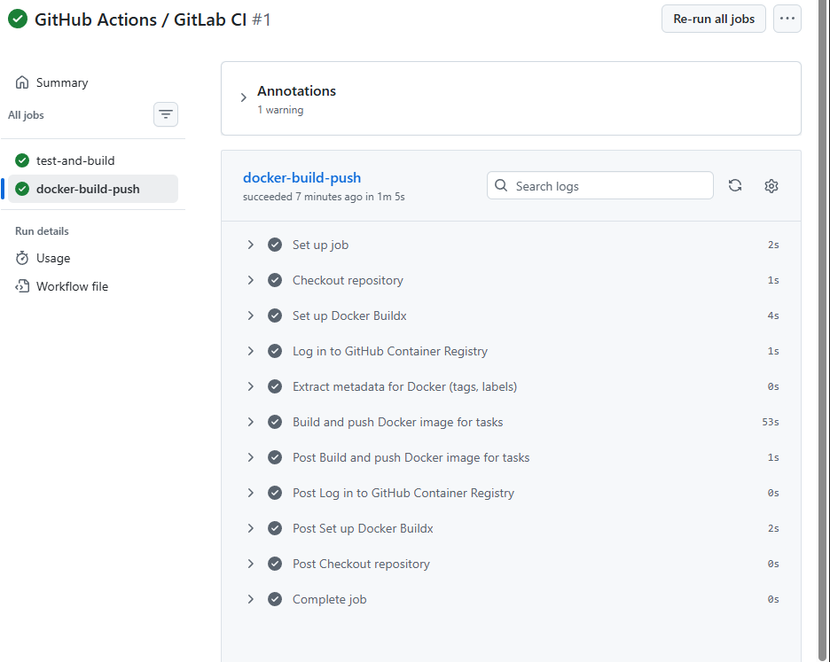

# Практика 8
## Выполнил: Студент ЭФМО-02-25 Фомичев Александр Сергеевич
### Цель работы

Настроить автоматическую проверку качества и сборку Go-сервисов с помощью GitHub Actions: запуск тестов, компиляция, сборка Docker-образа и публикация в container registry. Освоить основы CI/CD, управление секретами и версионирование артефактов.

### Структура:
```
deploy
    monitoring
        prometheus.yml
        docker-compose.yml
    tls
        docker-compose.yml
        nginx.conf
        init.sql
        cert.pem
        key.pem 
services 
    auth
        Dockerfile
        cmd
            auth
                main.go
        internal
            grpc
                server.go
            http
                handlers
                    login.go
                    verify.go
                routes.go
            service
                auth.go
    tasks
        Dpkerfile
        cmd
            tasks
                main.go
        internal
            metrics
                metrics.go
            grpcclient
                client.go
            http
                middleware
                    csrf.go
                    metrics.go
                handlers
                    tasks.go
                    middleware
                        auth.go
                routes.go
            service
                tasks.go
shared
    shared
        logger
            logger.go 
    middleware
        security.go
        requestid.go
        accesslog.go
        grpclog.go
    httpx
        client.go
pkg
    api
        auth
            v1
                auth.proto
                auth.pb.go
                auth_grpc.pb.go
docs
    pz17_api.md
.dockerignore
README.md
go.mod
go.sum
```

### Файл pipeline (`ci.yml`) Содержит два jobs:
   - `test-and-build`: запуск тестов (`go test`), сборка бинарников auth и tasks.
   - `docker-build-push`: сборка Docker-образа tasks и публикация в GitHub Container Registry.

###  Описание шагов pipeline:
   - **Checkout** – получение кода.
   - **Setup Go** – установка Go 1.25.
   - **Cache** – кеширование модулей.
   - **go mod download** – загрузка зависимостей.
   - **go test** – запуск всех тестов (включая добавленный `TestSanitizeString`) с флагами `-race` и `-cover`.
   - **go build** – проверка компиляции обоих сервисов.
   - **Docker Buildx** – подготовка сборщика образов.
   - **Login to GHCR** – аутентификация через `GITHUB_TOKEN`.
   - **Metadata extraction** – формирование тегов (например, `main-<sha>`, `latest`).
   - **Build and push** – сборка образа tasks и пуш в registry.

### Скрин/лог успешного прогона:

**тест**

****

**тест**

****

**тест**

****

**тест**
****

### Публикация образа в registry – образ загружается в `github.com/<owner>/<repo>/bin`. Теги:
   - `latest` – для ветки по умолчанию (main/master).
   - `main-<short_sha>` – всегда при успешной сборке.
   Пример: `ghcr.io/student/p8/bin/main`.

#### Вывод

В ходе занятия настроен CI/CD пайплайн, который автоматически проверяет код (тесты, сборку) и при успехе собирает Docker-образ сервиса `tasks`, публикуя его в GitHub Container Registry. Тест на XSS-санитизацию демонстрирует практическую пользу unit-тестов. Такой пайплайн обеспечивает:
- Раннее обнаружение ошибок.
- Единообразие сборки.
- Готовность к деплою (образ всегда доступен).
- Основы безопасного хранения секретов.

**Контрольные вопросы (кратко):**
1. CI – непрерывная интеграция (сборка, тесты). CD – непрерывная доставка/развёртывание.
2. `go test` гарантирует, что изменения не сломают логику.
3. Секреты нельзя хранить в репозитории, иначе они станут доступны всем.
4. Версионирование образов позволяет отследить, какой код развёрнут, и откатиться.
5. Автоматический деплой без контроля может выкатить дефектную версию. Нужен ручной апрув или тестовый стенд.

**Итог:** цель достигнута – создан рабочий пайплайн, готовый к расширению (добавление линтеров, интеграционных тестов, публикация второго сервиса, полноценный деплой).
